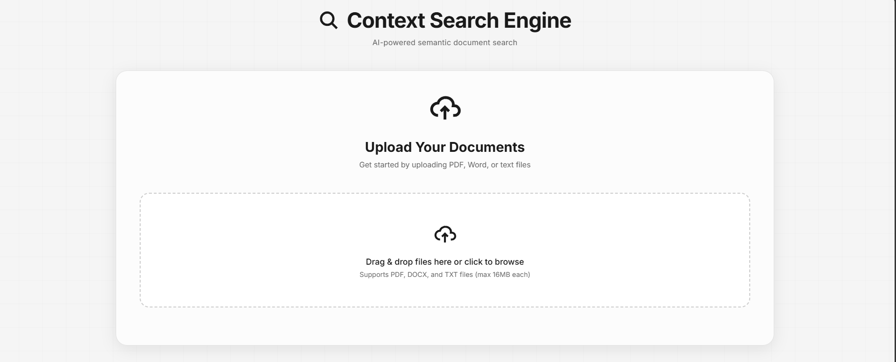
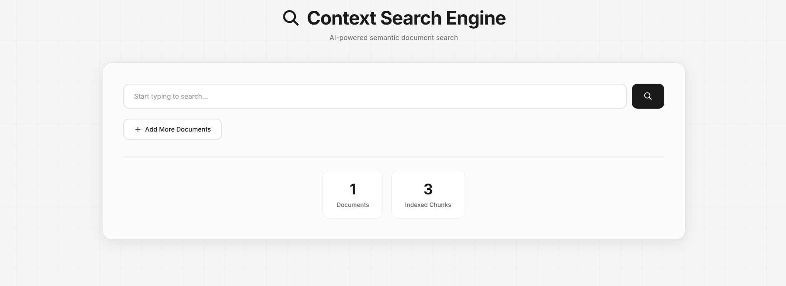
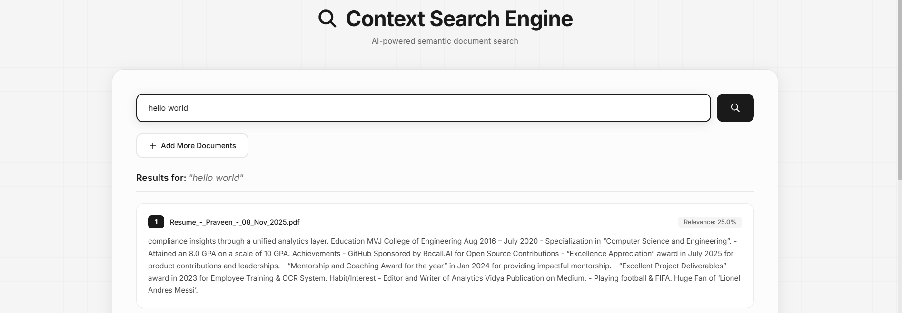

# Context Search Engine

> An AI-powered semantic document search system for learning, research, and real-world experimentation


## 🎯 What is this Project?

This project is a hands-on learning tool that demonstrates the complete journey from **Data Ingestion to Query Filtering** using modern vector search technology. It's designed for:

- **Students & College Grads**: Learn how semantic search works in practice, not just theory
- **Researchers**: Test and experiment with your own documents and models
- **Developers**: Understand the fundamentals of vector databases and embeddings
- **Data Scientists**: Perform A/B testing on different models and document processing techniques

Think of it as your personal laboratory for understanding how search engines like Google actually understand what you're looking for, not just match keywords.

## ✨ Key Features

### Current Features

- **📁 Document Upload**: Drag & drop PDF, Word, and text files
- **🔍 Smart Search**: Type-ahead search that understands context, not just keywords
- **🧠 AI-Powered**: Uses DistilBERT for semantic understanding
- **⚡ Fast Search**: FAISS vector database for lightning-quick results
- **📊 Document Management**: View, organize, and delete your documents
- **🎨 Clean Interface**: Minimalist glassmorphism design
- **📱 Fully Responsive**: Works on desktop, tablet, and mobile
- **💾 Organized Storage**: Timestamp-based file organization
- **🔒 Privacy First**: Everything runs locally on your machine

### What Makes It Special for Learning

- **See the Process**: Watch how documents get chunked, embedded, and indexed
- **Experiment Freely**: Upload your own documents and test different queries
- **Real-World Testing**: Compare search results with different document types
- **A/B Testing Ready**: Perfect for testing different embedding models or chunking strategies
- **Transparent Architecture**: Clean, readable code that's easy to understand and modify

## 📸 Screenshots

### Upload Interfaces



### Search




### Document Management


## 🏗️ Architecture

The application follows a simple, modular architecture:


### How It Works

1. **Document Upload**: User uploads documents (PDF, DOCX, TXT)
2. **Text Extraction**: System extracts plain text from documents
3. **Chunking**: Text is split into manageable chunks (500 words with 50-word overlap)
4. **Embedding**: Each chunk is converted to a 768-dimensional vector using DistilBERT
5. **Indexing**: Vectors are stored in FAISS for fast similarity search
6. **Search**: User queries are converted to vectors and matched against indexed chunks
7. **Results**: Top 3 most relevant chunks are returned with relevance scores

## 📂 Project Structure

```
context-search-engine/
│
├── app.py                      # Flask web application
├── document_processor.py       # Document handling & indexing logic
├── search_engine.py           # Legacy search (can be removed)
├── create_index.py            # Legacy indexing (can be removed)
│
├── templates/
│   └── index.html             # Main UI template
│
├── static/
│   ├── css/
│   │   └── style.css          # Glassmorphism styling
│   └── images/                # UI assets & screenshots
│
├── uploads/                   # Document storage (timestamp-organized)
│   └── YYYYMMDD/             # Date-based folders
│       └── filename_HHMMSS.ext
│
├── faiss_index.idx            # FAISS vector index (generated)
├── index_to_chunk.pkl         # Chunk mapping (generated)
├── document_metadata.pkl      # Document metadata (generated)
│
├── requirements.txt           # Python dependencies
├── .gitignore                # Git ignore rules
└── README.md                 # This file
```

## 🚀 Getting Started

### Prerequisites

- Python 3.8 or higher
- pip (Python package manager)
- 4GB RAM minimum (8GB recommended)
- Internet connection (first run only, to download the DistilBERT model)

### Installation

1. **Clone the repository**
   ```bash
   git clone https://github.com/inboxpraveen/context-search-engine.git
   cd context-search-engine
   ```

2. **Install dependencies**
   ```bash
   pip install -r requirements.txt
   ```
   
   This will install:
   - Flask (Web framework)
   - Transformers & PyTorch (For DistilBERT embeddings)
   - FAISS (Vector similarity search)
   - PyPDF2 (PDF processing)
   - python-docx (Word document processing)
   - Other supporting libraries

3. **Run the application**
   ```bash
   python app.py
   ```

4. **Open your browser**
   ```
   Navigate to: http://localhost:5000
   ```

### First Time Use

1. You'll see an upload screen (no documents yet)
2. Drag & drop your documents or click to browse
3. Upload PDF, Word (.docx), or text (.txt) files
4. Wait for indexing to complete
5. Start searching!

### Using the Search

- Type at least 3 characters to trigger search
- Search happens automatically as you type (500ms delay)
- Press Enter for immediate search
- Results show relevance scores and source documents

### Managing Documents

- Click on the "Documents" stat card to view all documents
- View document content by clicking "View"
- Delete documents with confirmation (removes all indexes)

## 🧪 Use Cases & Experiments

### For Students

- **Learn Vector Search**: See how text becomes numbers and how similarity works
- **Understand Embeddings**: Experiment with different query phrasings
- **Study Information Retrieval**: Compare semantic vs keyword search

### For Researchers

- **Test Document Processing**: Try different chunking sizes and overlaps
- **Model Comparison**: Swap DistilBERT with other models (BERT, RoBERTa, etc.)
- **Domain Testing**: Upload domain-specific documents and test accuracy

### For Developers

- **Integration Testing**: Use as a microservice in larger applications
- **Performance Benchmarking**: Test with different document volumes
- **UI/UX Experiments**: Modify the frontend for different use cases

### A/B Testing Ideas

1. **Different Models**: Compare DistilBERT vs BERT vs Sentence-BERT
2. **Chunk Sizes**: Test 300 vs 500 vs 1000 word chunks
3. **Embedding Dimensions**: Experiment with model dimensions
4. **Pooling Methods**: Try mean, max, or CLS pooling

## 🔮 What's Next

### Planned Features

- [ ] **Multi-User Support**: User authentication and personal document spaces
- [ ] **Advanced Filters**: Filter by document type, date, or custom tags
- [ ] **Batch Upload**: Upload entire folders at once
- [ ] **Export Results**: Download search results as CSV or JSON
- [ ] **Search History**: Track and revisit previous searches
- [ ] **Highlighting**: Highlight matched text within documents
- [ ] **Model Selection**: Choose between different embedding models
- [ ] **API Endpoints**: RESTful API for programmatic access
- [ ] **Cloud Deployment**: Docker container and deployment guides
- [ ] **Analytics Dashboard**: Visualize search patterns and document stats

### Future Improvements

- **GPU Support**: FAISS GPU for faster indexing and search
- **Multilingual**: Support for non-English documents
- **OCR Integration**: Extract text from scanned PDFs and images
- [ ] **Incremental Indexing**: Add documents without rebuilding entire index
- **Advanced Chunking**: Smart chunking based on document structure
- **Query Expansion**: Suggest related queries or autocomplete

## 🤝 Contributing

We welcome contributions from everyone! Whether you're fixing a bug, adding a feature, or improving documentation.

### How to Contribute

1. **Fork the repository**
2. **Create a feature branch**
   ```bash
   git checkout -b feature/your-feature-name
   ```
3. **Make your changes**
   - Write clean, readable code
   - Add comments for complex logic
   - Update documentation if needed
4. **Test thoroughly**
   - Test with different document types
   - Check responsive design
   - Verify search accuracy
5. **Submit a Pull Request**
   - Describe what you changed and why
   - Reference any related issues
   - Include screenshots for UI changes

### Areas for Contribution

- 🐛 **Bug Fixes**: Found a bug? Fix it!
- ✨ **New Features**: Implement something from the "What's Next" section
- 📚 **Documentation**: Improve README, add tutorials, or create guides
- 🎨 **UI/UX**: Enhance the interface or add themes
- 🧪 **Testing**: Add unit tests or integration tests
- 🌍 **Localization**: Translate UI to other languages
- 📊 **Examples**: Create example notebooks or tutorials

### Code Style

- Follow PEP 8 for Python code
- Use meaningful variable and function names
- Add docstrings to functions
- Keep functions small and focused
- Comment complex algorithms

### Reporting Issues

Found a bug or have a suggestion? [Open an issue](https://github.com/inboxpraveen/context-search-engine/issues) with:
- Clear description
- Steps to reproduce (for bugs)
- Expected vs actual behavior
- Screenshots if applicable

## 📚 Learning Resources

Want to understand the concepts better?

- **Vector Embeddings**: How text becomes numbers
- **Semantic Search**: Why it's better than keyword matching
- **FAISS**: Facebook's similarity search library
- **BERT Models**: Understanding transformer-based embeddings
- **Information Retrieval**: The science behind search engines

## 📄 License

This project is licensed under the MIT License - see the [LICENSE](LICENSE) file for details.

You are free to:
- ✅ Use commercially
- ✅ Modify
- ✅ Distribute
- ✅ Private use

Just remember to:
- Include the original license
- State changes made

## 🙏 Acknowledgments

- **Hugging Face**: For the amazing Transformers library
- **Facebook AI**: For FAISS vector search
- **Flask Community**: For the web framework
- **Open Source Community**: For all the supporting libraries

## 📬 Contact & Support

- **Issues**: [GitHub Issues](https://github.com/inboxpraveen/context-search-engine/issues)
- **Discussions**: [GitHub Discussions](https://github.com/inboxpraveen/context-search-engine/discussions)
- **Email**: inboxpraveen.17@gmail.com

---

**Star ⭐ this repo if you find it useful!**

Made with ❤️ for learners, researchers, and developers exploring the world of semantic search.
