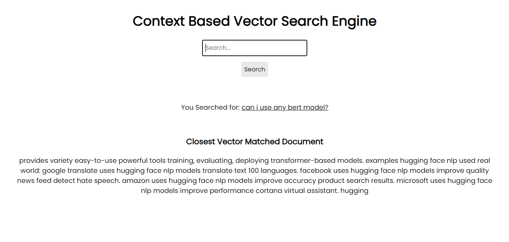
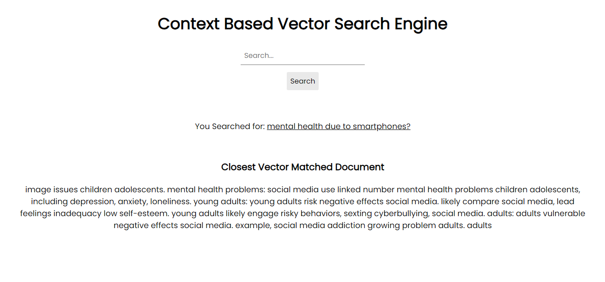

# Contextual Text Search Engine Using Vector Data and FAISS


The primary objective of this project is to showcase Vector Search Capabilities by providing a user-friendly interface that enables users to perform contextual searches across a corpus of text documents. By leveraging the power of Hugging Face's BERT and Facebook's FAISS, we return highly relevant text passages based on the semantic meaning of the user's query rather than mere keyword matches. This project serves as a starting point for developers, researchers, and enthusiasts who wish to dive deeper into the world of contextualized text search and enhance their applications with state-of-the-art NLP techniques. 

My goal is to ensure we understand vector database behind the scenes from scratch.

Screen Shot of Application:





## 1. Prerequisites

In order to run on your system, you can install the all the necessary packages via pip using requirements files:

```shell
pip install -r requirements.txt
```

For your information, I am using Python 3.10.1. 

*However, if you have a GPU, you are requested to install FAISS GPU for faster and larger database integrations.*


## 2. Scope of the Project

The current version of this project encompasses:

- A basic web interface built using Flask where users can input and submit their search queries.
- A backend search engine that:
  - Transforms user queries into semantic vectors using Distil BERT.
  - Efficiently compares the query vector against a pre-indexed set of vectors (corresponding to text documents) stored in a FAISS index.
  - Returns the most contextually relevant text passage from the corpus.
  - Highlights the keywords in the returned text passage that are contextually matched.

While the project offers a functional contextual search system, it is designed to be modular, allowing for potential expansion and integration into larger systems or applications.


## 3. Explanation of Overall Approach

The foundation of this project lies in the belief that modern NLP techniques can offer far more accurate and contextually relevant search results compared to traditional keyword-based methods. Here's a breakdown of our approach:

1. **User Interface**: The frontend, built using Flask, serves as the interaction point for the users. It's kept simple and intuitive.
2. **Query Vectorization**: When a user submits a query, the backend system transforms it into a semantic vector using Distil BERT. This vector encapsulates the meaning of the query.
3. **Searching with FAISS**: FAISS, an efficient similarity search library, is utilized to quickly compare the query vector against a pre-established index of vectors from the text corpus. The closest match, in terms of semantic meaning, is identified.
4. **Returning Results**: Once the most relevant text passage is identified, the system also highlights keywords or phrases that match the user's query contextually, offering a visual cue to the user about why a particular passage was deemed relevant.
5. **Iterative Refinement**: The underlying models and techniques are open to refinements based on newer research, user feedback, and specific application needs.

Based on the approach, I have divided the project into 2 sections:

**Section 1: Generating Searchable Vectored Data**

In this section, we first read input from documents, break it down to smaller chunks, create vectors using BERT based model, and then store it efficiently using FAISS. Here is a flow diagram that illustrates the same.


We create FAISS Index file which contains vector representation of the chunked document. We also store index of each chunk. This is maintain so that we do not have to query the database/documents again. This helps us in removing redundant read operations. 

We perform this section using create_index.py. It will generate the above 2 files. If you need to use other models, you are open to do it from HuggingFace hub :handshake:  

> *Note: If you find issues in setting up hyperparameter for dimension, check the models config.json file to find details on dimension of the model you are trying to use.*

**Section 2: Building Searchable Application Interface**

In this section, my goal is to build an interface which can allow users to interact with the documents. I prioritize minimalistic design  without causing additional hurdles. 


## 4. Project Structure

1. `index.html`: Front-end HTML page for inputting search queries.
2. `app.py`: Flask application that serves the front-end and handles search queries.
3. `search_engine.py`: Contains logic for embedding generation, FAISS searching, and keyword highlighting.

```shell
/context_search/
    - templates/
        - index.html
    - static/
    	- css/
    		- style.css
    	- images/
    		- img1.png
    		- img2.png
    		- Approach.png files
    - app.py
    - search_engine.py
    - create_index.py
    - index_to_chunk.pkl
    - faiss_index.idx
```


## 5. Usage

1. Ensure you have a trained FAISS index (`faiss_index.idx`) and an accompanying mapping from index to text chunk (`index_to_chunk.pkl`). 
2. Start the Flask application:

```
python app.py 
-- OR --
flask run --host=127.0.0.1 --port=5000
```

1. Open a web browser and go to `http://localhost:5000`.
2. Enter a search query and observe the contextually relevant result.


## 6. Things to Do - for Improvements

There's always room for enhancements. Here are some potential improvements and additional features that can be integrated:

1. **Scalability**: Currently, the system is built for relatively smaller corpora. Consider leveraging distributed systems or cloud-based solutions to handle larger datasets.
2. **Advanced Highlighting**: Improve the keyword highlighting system to ensure that contextually relevant phrases (and not just individual words) are highlighted.
3. **Feedback Loop**: Incorporate a user feedback mechanism where users can rate the relevance of the returned results. This can be used for fine-tuning the models in the future.
4. **Support for Multiple Document Types**: Extend support for various document types such as PDF, DOCX, etc., allowing users to search across different formats.
5. **Enhanced Frontend**: Improve the user interface, perhaps integrating advanced features like autocomplete, query suggestions, or a more sophisticated result display.
6. **Support for Multilingual Searches**: Expand the system to support queries in multiple languages, returning results from a multilingual corpus.


## 7. License

This project is under the MIT License. Feel free to use by cite, modify, distribute, and contribute. [Read more](https://github.com/inboxpraveen/context-search-engine/blob/main/LICENSE).


## 8. Contributing

If you're interested in improving this project, your contributions are welcome! Please open a Pull Request or Issue on this repository. I am essentially prioritizing the above things to do for improvements. Other pull requests will also be considered but less prioritized.

Thanks in advance for your interest. :happy: . 
