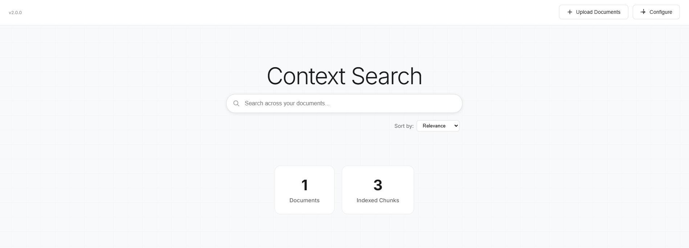

# Context Search Engine

> An AI-powered semantic document search platform for learning, research, and real-world experimentation


[](CHANGELOG.md)
[](LICENSE)

## 🎯 What is this Project?

This project is a hands-on learning tool and experimentation platform that demonstrates the complete journey from **Data Ingestion to Query Filtering** using modern vector search technology. It's designed for:

- **Students & College Grads**: Learn how semantic search works in practice, not just theory
- **Researchers**: Test and experiment with your own documents and models  
- **Developers**: Understand the fundamentals of vector databases and embeddings
- **Data Scientists**: Perform A/B testing on different models and document processing techniques

Think of it as your **personal laboratory** for understanding how modern search engines actually understand what you're looking for, not just match keywords.

## ✨ Key Features

### Current Features (v2.0.0)

- **🎨 Google-Style Interface**: Clean, professional search experience with centered search box
- **⚙️ Fully Configurable**: Customize models, chunking, search parameters via UI
- **📁 Document Upload**: Drag & drop PDF, Word, and text files
- **🔍 Smart Search**: Type-ahead search that understands context (3+ characters, 500ms debounce)
- **🧠 AI-Powered**: Supports any HuggingFace sentence-transformer model (default: DistilBERT)
- **⚡ Fast Search**: FAISS vector database for lightning-quick similarity search
- **📊 Enhanced Results**: View document name, page number, chunk number, and source
- **🔄 Sort & Filter**: Sort results by relevance or recent uploads
- **📱 Fully Responsive**: Works perfectly on desktop, tablet, and mobile
- **💾 Smart Storage**: Timestamp-based file organization (YYYYMMDD/filename_HHMMSS.ext)
- **🔒 Privacy First**: Everything runs locally on your machine
- **📈 Version Tracking**: Built-in version display and changelog

### What Makes It Special for Learning

- **See the Process**: Watch how documents get chunked, embedded, and indexed
- **Experiment Freely**: Upload your own documents and test different queries
- **Model Comparison**: Swap between different embedding models with a few clicks
- **Real-World Testing**: Compare search results with different document types
- **A/B Testing Ready**: Perfect for testing different chunking strategies or models
- **Transparent Architecture**: Clean, readable code that's easy to understand and modify
- **Configuration Playground**: Tune parameters and see immediate effects on search quality

## 📸 Screenshots

### Upload & Configure Interface


### Search




### Document Management


## 🏗️ Architecture

The application follows a simple, modular architecture perfect for learning and experimentation:


### How It Works

1. **Document Upload**: User uploads documents (PDF, DOCX, TXT)
2. **Text Extraction**: System extracts plain text from documents (with page tracking for PDFs)
3. **Configurable Chunking**: Text is split into chunks (default: 500 words with 50-word overlap)
4. **Embedding Generation**: Each chunk is converted to vectors using configured model (default: DistilBERT 768-dim)
5. **FAISS Indexing**: Vectors are stored in FAISS index for fast similarity search
6. **Search Processing**: User queries are vectorized and matched against indexed chunks
7. **Smart Results**: Top results returned with metadata (page, chunk, relevance score)
8. **Flexible Sorting**: Results can be sorted by relevance or recency

### Configuration Options

The system is fully configurable through the UI:

- **Model Selection**: Any HuggingFace sentence-transformer model
- **Chunk Size**: 100-2000 words (default: 500)
- **Overlap**: 0-500 words (default: 50)
- **Result Count**: 1-20 results (default: 5)
- **Top K**: 5-50 candidates (default: 10)
- **Dimension**: Match your model's output (default: 768)

## 📂 Project Structure

```
context-search-engine/
│
├── app.py                      # Flask web application & API endpoints
├── document_processor.py       # Document processing, embedding & indexing
├── config.py                   # Configuration management system
├── search_engine.py           # Legacy (can be removed)
├── create_index.py            # Legacy (can be removed)
│
├── templates/
│   └── index.html             # Main UI (Google-style search interface)
│
├── static/
│   ├── css/
│   │   └── style.css          # Modern minimalist styling
│   └── images/                # UI assets & screenshots
│
├── uploads/                   # Document storage (auto-organized)
│   └── YYYYMMDD/             # Date-based folders
│       └── filename_HHMMSS.ext  # Timestamped files
│
├── faiss_index.idx            # FAISS vector index (generated)
├── index_to_chunk.pkl         # Chunk-to-text mapping (generated)
├── document_metadata.pkl      # Document metadata (generated)
├── app_config.json           # User configuration (generated)
│
├── requirements.txt           # Python dependencies
├── .gitignore                # Git ignore rules
├── CHANGELOG.md              # Version history & release notes
├── LICENSE                   # MIT License
└── README.md                 # This file
```

## 🚀 Getting Started

### Prerequisites

- **Python**: 3.8 or higher
- **pip**: Python package manager
- **RAM**: 4GB minimum (8GB recommended for larger documents)
- **Internet**: First run only (downloads embedding model ~250MB)
- **Disk Space**: ~500MB for models + your documents

### Installation

1. **Clone the repository**
   ```bash
   git clone https://github.com/inboxpraveen/context-search-engine.git
   cd context-search-engine
   ```

2. **Install dependencies**
   ```bash
   pip install -r requirements.txt
   ```
   
   This installs:
   - `Flask 3.1.2` - Web framework
   - `transformers 4.57.3` - HuggingFace transformers for embeddings
   - `torch` - PyTorch for model inference
   - `faiss-cpu 1.13.0` - Vector similarity search
   - `PyPDF2 3.0.1` - PDF text extraction
   - `python-docx 1.2.0` - Word document processing
   - `numpy 2.3.5` - Numerical operations
   - Other supporting libraries

3. **Run the application**
   ```bash
   python app.py
   ```

4. **Open your browser**
   ```
   Navigate to: http://localhost:5000
   ```

### First Time Use

1. You'll see a Google-style search interface
2. If no documents exist, you'll see "Please upload some documents to start searching"
3. Click **"Upload Documents"** button (top right)
4. Drag & drop your files or click to browse
5. Upload PDF, Word (.docx), or text (.txt) files
6. Wait for indexing to complete (progress shown)
7. Start searching with the main search box!

### Using the Search

- Type at least **3 characters** to trigger search
- Search happens automatically as you type (500ms delay)
- Press **Enter** for immediate search
- Results show:
  - **Rank** (#1, #2, etc.)
  - **Document Name**
  - **Page Number** (for PDFs)
  - **Chunk Number**
  - **Matched Text**
  - **Relevance Score**
  - **"View Source"** button

### Sorting Results

Use the dropdown to sort by:
- **Relevance**: Best semantic matches first (default)
- **Recent**: Newest documents first

### Managing Documents

- Click the **"Documents"** stat card to view all documents
- Table shows: Sr. No, Name, Type, Pages, Upload Date, Actions
- **View**: See full document content
- **Delete**: Remove document (with confirmation)

### Configuration

Click **"Configure"** button (top right) to customize:

1. **Model**: Enter any HuggingFace repo ID
   - Examples: `distilbert-base-uncased`, `sentence-transformers/all-MiniLM-L6-v2`
   - Must be compatible with sentence-transformers
   
2. **Chunk Size**: Words per chunk (100-2000)
   - Smaller = more precise, more chunks
   - Larger = more context, fewer chunks
   
3. **Overlap**: Words of overlap between chunks (0-500)
   - Prevents information loss at chunk boundaries
   
4. **Search Results**: Number of results to display (1-20)

5. **Top K**: Size of candidate pool (5-50)
   - Higher = better quality, slower search
   
6. **Dimension**: Model output dimension
   - Must match your chosen model's embedding size

**Note**: Changing model or chunking requires rebuilding the index (automatic prompt).

## 🧪 Use Cases & Experiments

### For Students

#### Learn Vector Search
- Upload a textbook chapter and search for concepts
- See how similar concepts are grouped together
- Compare semantic vs keyword matching

#### Understand Embeddings  
- Try different phrasings of the same query
- Observe how context affects results
- Experiment with synonyms and related terms

#### Study Information Retrieval
- Upload multiple documents on same topic
- See how the system ranks relevance
- Learn about precision and recall

### For Researchers

#### Test Document Processing
- Compare different chunk sizes (300 vs 500 vs 1000 words)
- Experiment with overlap percentages
- Analyze impact on retrieval quality

#### Model Comparison
Test different embedding models:
- `distilbert-base-uncased` (fast, good quality)
- `sentence-transformers/all-MiniLM-L6-v2` (balanced)
- `sentence-transformers/all-mpnet-base-v2` (high quality)
- `bert-base-uncased` (standard BERT)

#### Domain Testing
- Upload domain-specific documents (medical, legal, technical)
- Test if general models work or if fine-tuning is needed
- Measure accuracy on domain queries

### For Developers

#### Integration Testing
- Use as microservice in larger applications
- Test API endpoints programmatically
- Integrate with existing document workflows

#### Performance Benchmarking
- Test with different document volumes (10, 100, 1000+ docs)
- Measure indexing time vs document size
- Optimize chunk size for your use case

#### UI/UX Experiments
- Modify the frontend for specific use cases
- Add custom features (filters, tags, etc.)
- Create domain-specific variants

### A/B Testing Ideas

1. **Model Comparison**
   - Test: DistilBERT vs BERT vs Sentence-BERT
   - Measure: Query response time, relevance scores
   - Goal: Find best speed/accuracy tradeoff

2. **Chunk Size Impact**
   - Test: 300 vs 500 vs 1000 word chunks
   - Measure: Result precision, context coverage
   - Goal: Optimal chunk size for your documents

3. **Overlap Effects**
   - Test: 0% vs 10% vs 20% overlap
   - Measure: Information continuity, duplicate results
   - Goal: Best overlap to prevent context loss

4. **Pooling Methods**
   - Modify code to test: Mean vs Max vs CLS pooling
   - Measure: Semantic understanding quality
   - Goal: Best pooling for your document type

## 🔧 Advanced Usage

### Custom Models

To use a custom model:

1. Click "Configure" → Enter HuggingFace repo ID
2. Set correct dimension for your model
3. Save configuration
4. Rebuild index when prompted

**Popular Models:**
- `sentence-transformers/all-MiniLM-L6-v2` (384-dim, fast)
- `sentence-transformers/all-mpnet-base-v2` (768-dim, accurate)
- `sentence-transformers/paraphrase-multilingual-MiniLM-L12-v2` (384-dim, multilingual)

### Programmatic Access

The application exposes these endpoints:

- `GET /` - Main UI
- `POST /search` - Search documents
- `POST /upload` - Upload files
- `GET /documents` - List all documents
- `GET /documents/<id>` - Get document content
- `DELETE /documents/<id>` - Delete document
- `GET /config` - Get configuration
- `POST /config` - Update configuration
- `POST /rebuild-index` - Rebuild index

### Configuration File

Settings are stored in `app_config.json`:

```json
{
  "model_repo_id": "distilbert-base-uncased",
  "chunk_size": 500,
  "chunk_overlap": 50,
  "num_search_results": 5,
  "top_k": 10,
  "dimension": 768
}
```

You can edit this file directly or use the UI.

## 🔮 What's Next

### Version 2.1 (Planned)

- [ ] **Multi-User Support**: User authentication and personal document spaces
- [ ] **Document Folders**: Organize documents into categories
- [ ] **Search History**: Track and revisit previous searches  
- [ ] **Export Results**: Download search results as CSV/JSON
- [ ] **Query Analytics**: Track popular queries and patterns

### Version 2.2 (Planned)

- [ ] **Batch Upload**: Upload entire folders at once
- [ ] **Advanced Filters**: Filter by date range, document type, custom tags
- [ ] **Text Highlighting**: Highlight matched text within results
- [ ] **Query Suggestions**: Autocomplete and related queries
- [ ] **Document Preview**: Quick preview without full view

### Version 3.0 (Planned)

- [ ] **RESTful API**: Full API with authentication
- [ ] **Docker Support**: Container images and deployment guides
- [ ] **Cloud Templates**: Deploy to AWS, GCP, Azure
- [ ] **Analytics Dashboard**: Visualize search patterns and document stats
- [ ] **Multilingual Support**: UI and search in multiple languages
- [ ] **OCR Integration**: Extract text from scanned PDFs and images

### Future Enhancements

- **GPU Support**: FAISS GPU for faster indexing and search
- **Incremental Indexing**: Add documents without full rebuild
- **Advanced Chunking**: Smart chunking based on document structure
- **Query Expansion**: Automatic query reformulation
- **Result Caching**: Cache frequent queries
- **Hybrid Search**: Combine semantic and keyword search

See [CHANGELOG.md](CHANGELOG.md) for detailed version history.

## 🤝 Contributing

We welcome contributions from everyone! Whether you're fixing a bug, adding a feature, improving documentation, or sharing ideas.

### How to Contribute

1. **Fork the repository**
2. **Create a feature branch**
   ```bash
   git checkout -b feature/your-feature-name
   ```
3. **Make your changes**
   - Write clean, readable code
   - Add comments for complex logic
   - Follow existing code style
   - Update documentation if needed
4. **Test thoroughly**
   - Test with different document types
   - Check responsive design on mobile
   - Verify search accuracy
   - Test edge cases
5. **Submit a Pull Request**
   - Describe what you changed and why
   - Reference any related issues
   - Include screenshots for UI changes
   - Update CHANGELOG.md

### Areas for Contribution

- 🐛 **Bug Fixes**: Found a bug? Fix it!
- ✨ **New Features**: Implement features from the roadmap
- 📚 **Documentation**: Improve README, add tutorials, create guides
- 🎨 **UI/UX**: Enhance interface, add themes, improve accessibility
- 🧪 **Testing**: Add unit tests, integration tests, performance tests
- 🌍 **Localization**: Translate UI to other languages
- 📊 **Examples**: Create Jupyter notebooks, video tutorials, blog posts
- 🔧 **Tools**: Build deployment scripts, Docker configs, CI/CD pipelines

### Code Style

- **Python**: Follow PEP 8
- **JavaScript**: Use ES6+ features, prefer const/let over var
- **HTML**: Semantic HTML5, proper indentation
- **CSS**: BEM naming convention preferred
- **Comments**: Explain why, not what
- **Commits**: Clear, descriptive commit messages

### Reporting Issues

Found a bug or have a suggestion? [Open an issue](https://github.com/inboxpraveen/context-search-engine/issues) with:

- **Clear title** describing the issue
- **Detailed description** with context
- **Steps to reproduce** (for bugs)
- **Expected vs actual behavior**
- **Screenshots** if applicable
- **Environment details** (OS, Python version, etc.)

### Feature Requests

Have an idea? We'd love to hear it!

- Check existing issues first to avoid duplicates
- Explain the use case and benefit
- Provide examples or mockups if possible
- Tag with "enhancement" label

## 📚 Learning Resources

Want to dive deeper into the concepts?

### Vector Embeddings
- [Understanding Word Embeddings](https://towardsdatascience.com/word-embeddings-exploration-explanation-and-exploitation-with-code-in-python-5dac99d5d795)
- [Sentence Transformers Documentation](https://www.sbert.net/)
- [The Illustrated Word2vec](https://jalammar.github.io/illustrated-word2vec/)

### Semantic Search
- [What is Semantic Search?](https://www.elastic.co/what-is/semantic-search)
- [Building a Semantic Search Engine](https://www.pinecone.io/learn/semantic-search/)

### FAISS
- [FAISS Documentation](https://faiss.ai/)
- [FAISS Tutorial](https://www.pinecone.io/learn/faiss-tutorial/)

### BERT & Transformers
- [The Illustrated BERT](https://jalammar.github.io/illustrated-bert/)
- [HuggingFace Transformers](https://huggingface.co/docs/transformers/)
- [Understanding DistilBERT](https://medium.com/huggingface/distilbert-8cf3380435b5)

### Information Retrieval
- [Introduction to Information Retrieval](https://nlp.stanford.edu/IR-book/)
- [Modern Information Retrieval](http://grupoweb.upf.es/mir2ed/)

## 📄 License

This project is licensed under the **MIT License** - see the [LICENSE](LICENSE) file for details.

### You are free to:
- ✅ Use commercially
- ✅ Modify and adapt
- ✅ Distribute
- ✅ Use privately
- ✅ Use in patent claims

### Just remember to:
- Include the original license and copyright notice
- State significant changes made
- Include the full license text in distributions

## 🙏 Acknowledgments

This project stands on the shoulders of giants:

- **[Hugging Face](https://huggingface.co/)**: For the amazing Transformers library and model hub
- **[Facebook AI](https://ai.facebook.com/)**: For FAISS vector search library
- **[Flask Team](https://flask.palletsprojects.com/)**: For the excellent web framework
- **[PyPDF2](https://pypdf2.readthedocs.io/)**: For PDF processing capabilities
- **[python-docx](https://python-docx.readthedocs.io/)**: For Word document support
- **Open Source Community**: For all the supporting libraries and tools

Special thanks to all contributors and users who provide feedback and help improve this project!

## 📬 Contact & Support

### Get Help
- **Issues**: [GitHub Issues](https://github.com/inboxpraveen/context-search-engine/issues)
- **Discussions**: [GitHub Discussions](https://github.com/inboxpraveen/context-search-engine/discussions)
- **Email**: [inboxpraveen.17@gmail.com](mailto:inboxpraveen.17@gmail.com)

### Stay Updated
- **Watch** this repo for updates
- **Star** ⭐ if you find it useful
- **Fork** to experiment and contribute
- **Share** with others who might benefit

## 🌟 Star History

If this project helped you learn something new or solved a problem, please consider giving it a star!

[](https://star-history.com/#inboxpraveen/context-search-engine&Date)

---

**Version 2.0.0** | Made with ❤️ for learners, researchers, and developers exploring the world of semantic search.

**[View Changelog](CHANGELOG.md)** | **[Report Bug](https://github.com/inboxpraveen/context-search-engine/issues)** | **[Request Feature](https://github.com/inboxpraveen/context-search-engine/issues)**
